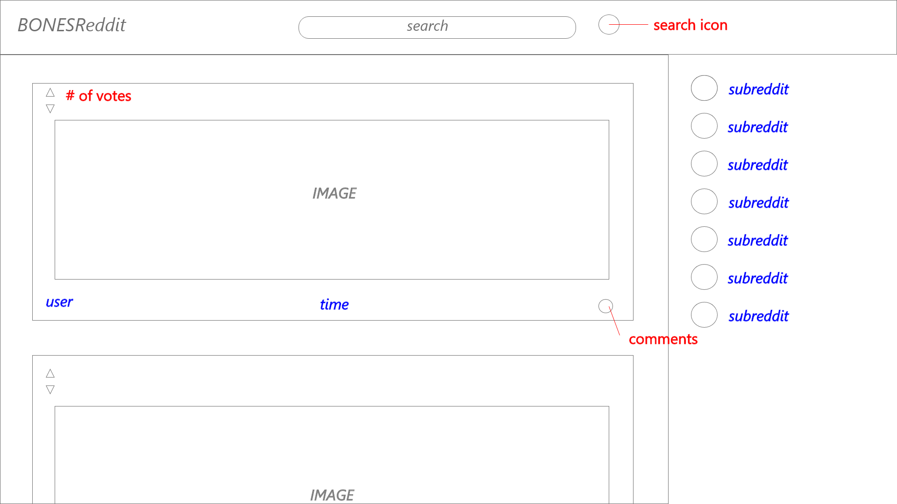

# README

## Wireframes

* Basic Wireframe

## Technologies used
* Nodejs
* React
* Redux
* Jest
* AdobeXD

## Features
* Reddit API
* Consolodating posts
* Cleaner UI

## Future work
* Ability to login and customize subreddits
* ability to post comments and upvote
